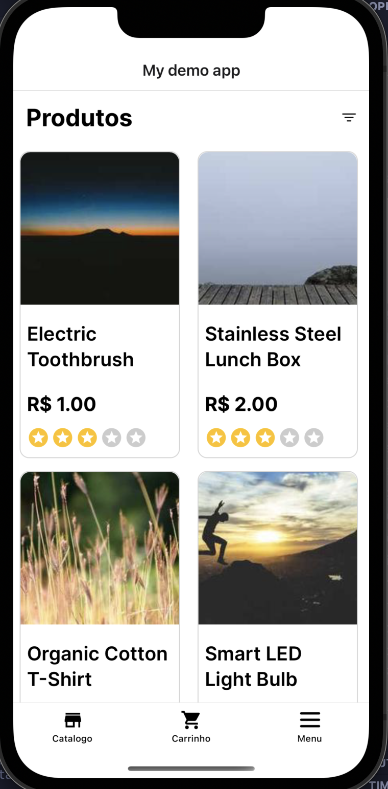

# My Demo Shop Fullstack app

This is a full-stack e-commerce application built to demonstrate a modern web and mobile development stack. The application consists of a back-end API and a mobile front-end.

### Tech Stack

- **Back-end:** NestJS
- **Front-end(Mobile):** React Native with Expo
- **Language:** TypeScript
- **Database:** PostgreSQL
- **Authentication:** JWT
- **API Documentation:** Swagger
- **State Management:** Zustand
- **Styling:** Native-wind

The back-end is built using NestJS, a progressive Node.js framework for building efficient and scalable server-side applications. The mobile front-end is developed using React Native and Expo, providing a smooth and performant user experience on both iOS and Android devices. TypeScript is used throughout the project to ensure type safety and improve productivity.

## Preview

### Back-end:


### Mobile:

<div style="display: flex; flex-direction: row; gap: 20px;">


</div>

## Requirements

- Node.js
- Docker
- pnpm
- Editor of your choice
- Git

## Quick start

Clone the repo to your machine:

```bash
git clone --recurse-submodules https://github.com/LucasTravessa/my-shop.git

# Or update git --recurse-submodules flag to true and then use git commands as normal
git config submodule.recurse true
```

To pull updates from remote repositories with submodules, use the following command:

```bash
git pull --recurse-submodules
```

To install and run the back-end, please refer to the [shop-demo-back README](./shop-demo-back/README.md).

To install and run the mobile app, please refer to the [shop-demo-mobile README](./shop-demo-mobile/README.md).
